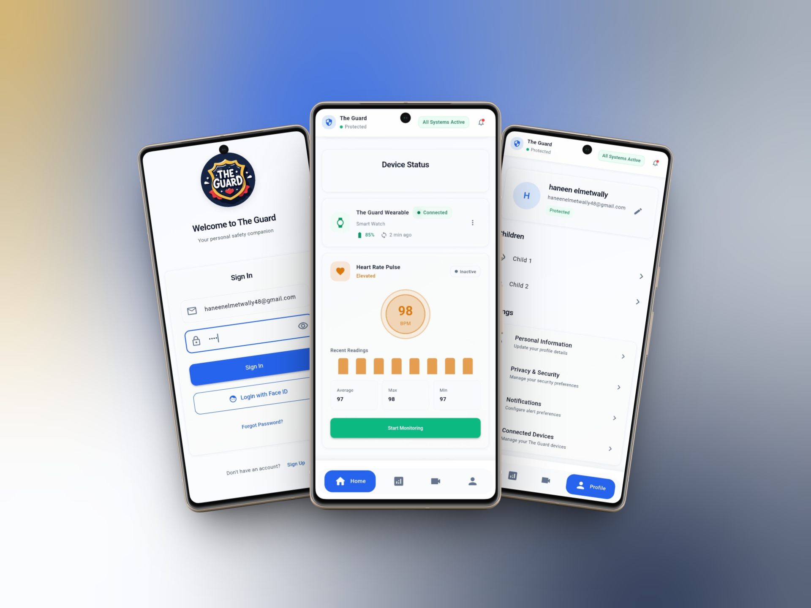
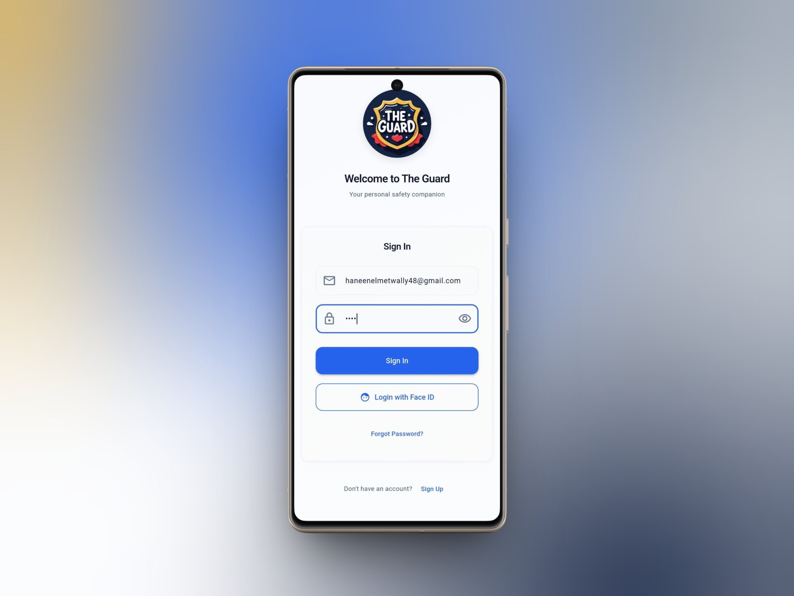
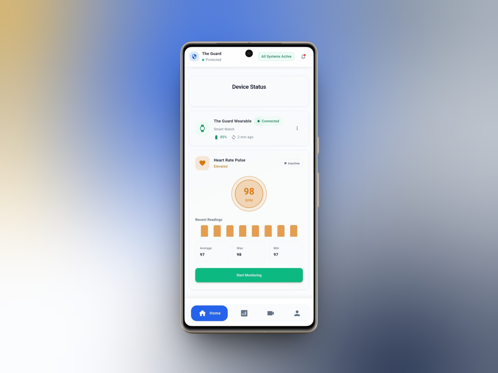
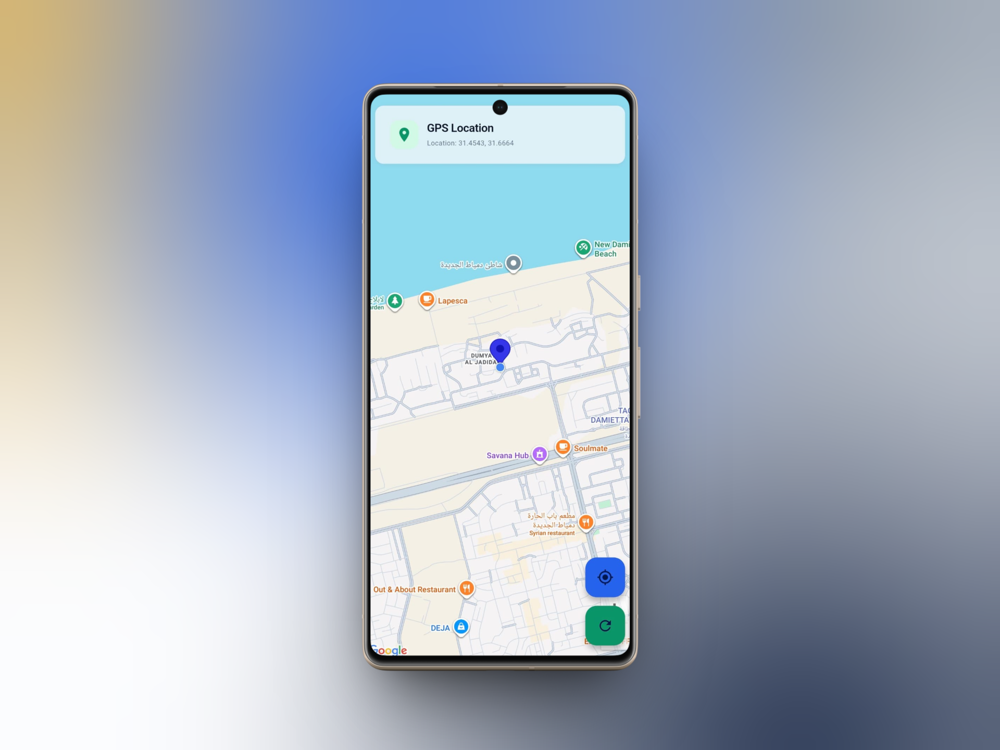
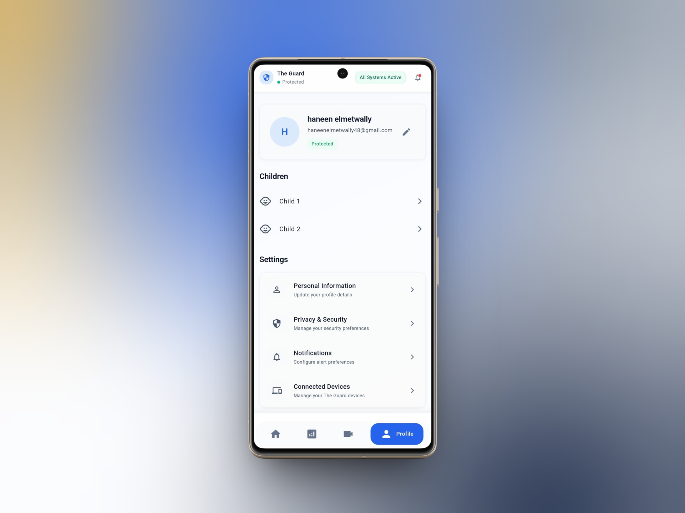

# 🛡️ The Guard - Advanced Personal Safety System

**The Guard** is a professional-grade mobile application built with **Flutter** and **Firebase**. It provides real-time protection and emergency response tools, featuring biometric security and enterprise-level encryption.

---

## 📸 App Preview

  

### Screenshots

  

<table>
  <tr>
    <td align="center">
      <b>Login Screen</b> 
      
    </td>
    <td align="center">
      <b>Home Dashboard</b> 
      
    </td>
  </tr>
  <tr>
    <td align="center">
      <b>GPS Location</b> 
      
    </td>
    <td align="center">
      <b>User Profile</b> 
      
    </td>
  </tr>
</table>

---

## ✨ Key Features
- **Biometric Authentication:** Secure access using Face ID and Fingerprint integration.
- **Real-time SOS Alerts:** Instant notification to emergency contacts with live GPS coordinates.
- **Enterprise-Level Security:** Built with bank-level encryption standards for user data protection.
- **Cloud Integration:** Real-time data synchronization using Firebase Firestore and Auth.

---

## 🚀 Tech Stack
- **Frontend:** Flutter & Dart
- **State Management:** (e.g., Provider/Bloc)
- **Backend:** Firebase (Auth, Firestore, Cloud Functions)
- **Security:** local_auth for Biometrics
- **Storage:** Shared Preferences for local persistence

---

## 🏗️ Architecture
This project implements **Clean Architecture** and follows the **MVVM** pattern, ensuring the codebase is scalable, maintainable, and testable.

---

## 🛠️ How to Run
1. Clone the repository: `git clone https://github.com/Haneenelmetwallly76/EVE-Guard.git`
2. Get dependencies: `flutter pub get`
3. Run the app: `flutter run`